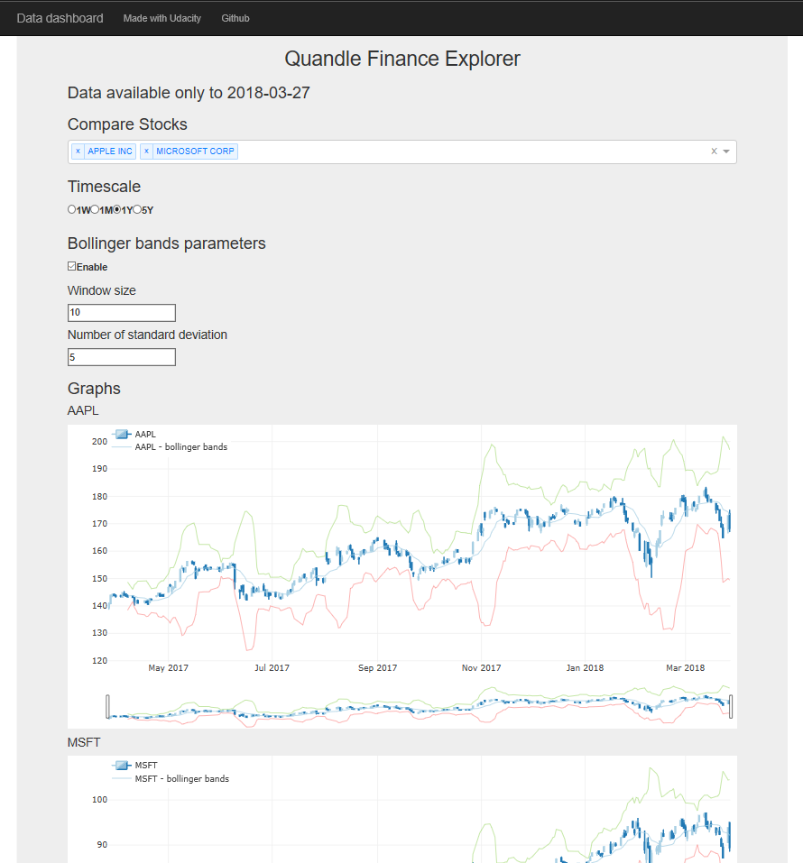
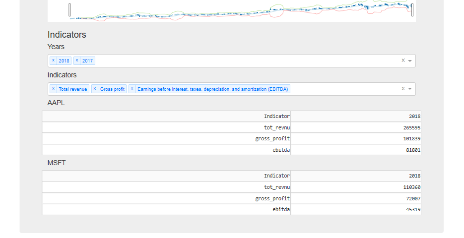

# Portfolio Exercise: Deploy a Data Dashboard

## Introduction

This project is part of The [Udacity](https://eu.udacity.com/) Data Scientist Nanodegree Program which is composed by:
* Term 1
    * Supervised Learning
    * Deep Learning
    * Unsupervised Learning
* Term 2
    * Write A Data Science Blog Post
    * Disaster Response Pipelines
    * Recommendation Engines
    
The goal of this project is to develop and deploy a data dashboard to put in practice the concepts explained in the lessons:
1. Wrangling your chosen data set to get the data in the format you want
2. Writing Python code to read in the data set and set up Plotly plots
3. Tweaking HTML so that the website has the design and information that you want

I have decided to build a finance data dashboard using the data from [quandl](https://www.quandl.com/).

## Software and Libraries

This project uses Python 3.11 and the following libraries:

* [NumPy](https://www.numpy.org/)
* [dash](https://plot.ly/dash/)
* [django](https://www.djangoproject.com/)
* [django-plotly-dash](https://pypi.org/project/django-plotly-dash/)
* [Pandas](http://pandas.pydata.org)
* [Quandl](https://pypi.org/project/Quandl/)

## Local configuration

To setup a new local enviroment and install all dependencies you can run `.\my_scripts\Set-Up.ps1`. It will install:

* [Python](https://www.python.org/)
* [uv](https://docs.astral.sh/uv/)
* [Pre-commit](https://pre-commit.com/)

Pre-commit is a framework for managing and maintaining multi-language pre-commit hooks. A pre-commit hook is a script that runs before a commit operation in a version control system. This allows to shift left code quality checks and remediations. You can change the hooks by updateing the file `.pre-commit-config.yaml`.

To trigger the pre-commit hooks without an actual commit you can run `pre-commit run --all-files -v`.

## Data

Have a look at the `data` folder and its [DATA.md](data/DATA.md) file.

## Testing

No test implemented.

## Running the code

## Console

From the project folder run `python finance_data.py`

### Web app

From the project folder run `python dash_app.py` to start the dash application. The default url to connect to it is http://127.0.0.1:8050/.

The application can be run stand alone or within a django web site using **django_plotly_dash**.

## Results

The dash application:

In the top part is possible to select wich stocks you want to compare, the time scale and the parameters for the [bollinger bands](https://en.wikipedia.org/wiki/Bollinger_Bands).

In the bottom part we can see the graphs of the stocks we have selected and we can choose to see different indicators with a dropbox menu.

## List of activities

In the [TODO.md](TODO.md) file you can find the list of tasks and on going activities.

## Licensing and Acknowledgements

Have a look at [LICENSE.md](LICENSE.md) and many thanks to [Quandl](https://www.quandl.com/) for the datasets and more information about the licensing of the data can be find [here](https://www.quandl.com/databases/WIKIP/documentation). Also thanks to [justdjango](https://github.com/justdjango/My_Dashboard/blob/master/finance/as_dash.py) for inspiring this project.

## Outro

I hope this repository was interesting and thank you for taking the time to check it out. On my Medium you can find a more in depth [story](https://medium.com/@simone-rigoni01/) and on my Blogspot you can find the same [post](https://simonerigoni01.blogspot.com/) in italian. Let me know if you have any question and if you like the content that I create feel free to [buy me a coffee](https://www.buymeacoffee.com/simonerigoni).